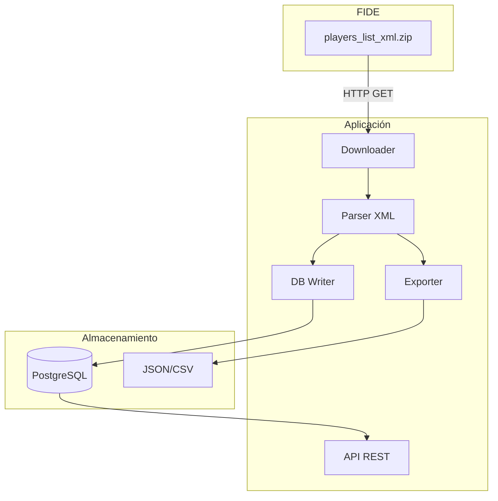

# Arquitectura

## Visión general

FIDE Scraper descarga los datos oficiales de la [Federación Internacional de Ajedrez (FIDE)](https://www.fide.com/), los procesa y los expone mediante una API REST. Utiliza **solo descargas oficiales** (no scraping HTML) para máxima robustez.

## Diagrama de flujo



## Componentes

### 1. Downloader (`src/downloader.py`)

- Descarga el archivo ZIP desde [FIDE Download](https://ratings.fide.com/download_lists.phtml). Por defecto usa `standard_rating_list_xml.zip` (~13 MB)
- Soporta listas históricas con el parámetro `?period=YYYY-MM-DD`
- Descomprime en memoria y retorna el contenido XML
- Usa `httpx` con timeout de 120 segundos

### 2. Parser (`src/parser.py`)

- Parsea el XML con `xml.etree.ElementTree.iterparse` para streaming
- Genera diccionarios por jugador sin cargar todo en memoria
- Maneja namespaces XML si FIDE los utiliza
- Campos extraídos: `fideid`, `name`, `country`, `sex`, `title`, `rating`, `games`, `rapid_rating`, `blitz_rating`, `birthday`, etc.

### 3. Base de datos
- **PostgreSQL 16** con modelo `Player`
- Índices en `fideid`, `country`, `rating` y compuesto `(country, rating)`
- Upsert por `fideid` para actualizaciones idempotentes

### 4. Importer (`src/importer.py`)

- Orquesta el pipeline: descarga → parse → upsert DB → export
- Procesa en batches de 5000 registros
- Exporta hasta 100.000 jugadores a JSON/CSV (configurable)

### 5. Exporter (`src/exporter.py`)

- Export a JSON
- Export a CSV
- Export opcional por país (`export_by_country`)

### 6. API REST (`src/api/`)

- FastAPI con documentación automática en `/docs`
- Endpoints: `/health`, `/players`, `/players/{fideid}`
- Filtros: paginación, país, rating mínimo

## Estructura del proyecto

```
fide-Scraper/
├── src/
│   ├── config.py       # Configuración
│   ├── downloader.py   # Descarga XML FIDE
│   ├── parser.py       # Parseo XML
│   ├── models.py       # Modelo Player
│   ├── database.py     # Conexión DB
│   ├── importer.py     # Pipeline completo
│   ├── exporter.py     # Export JSON/CSV
│   └── api/
│       ├── main.py     # FastAPI app
│       └── routes.py   # Rutas
├── scripts/
│   └── run_import.py   # CLI importación
├── docs/               # Documentación
├── Dockerfile
├── docker-compose.yml
└── requirements.txt
```

## Modelo de datos

| Campo | Tipo | Descripción |
|-------|------|-------------|
| `fideid` | int | ID único FIDE |
| `name` | str | Nombre completo |
| `country` | str | Código federación (ej: ESP, USA) |
| `sex` | str | M/F |
| `title` | str | Título (GM, IM, FM, etc.) |
| `rating` | int | Rating estándar |
| `games` | int | Partidas estándar |
| `rapid_rating` | int | Rating rápido |
| `rapid_games` | int | Partidas rápidas |
| `blitz_rating` | int | Rating blitz |
| `blitz_games` | int | Partidas blitz |
| `birthday` | int | Año de nacimiento |
| `flag` | str | Inactividad (I, WI, w) |

## Frecuencia de actualización FIDE

- **Publicación**: último día de cada mes
- **Vigencia**: desde el primer día del mes siguiente
- **Recomendación**: ejecutar import el día 1 de cada mes
