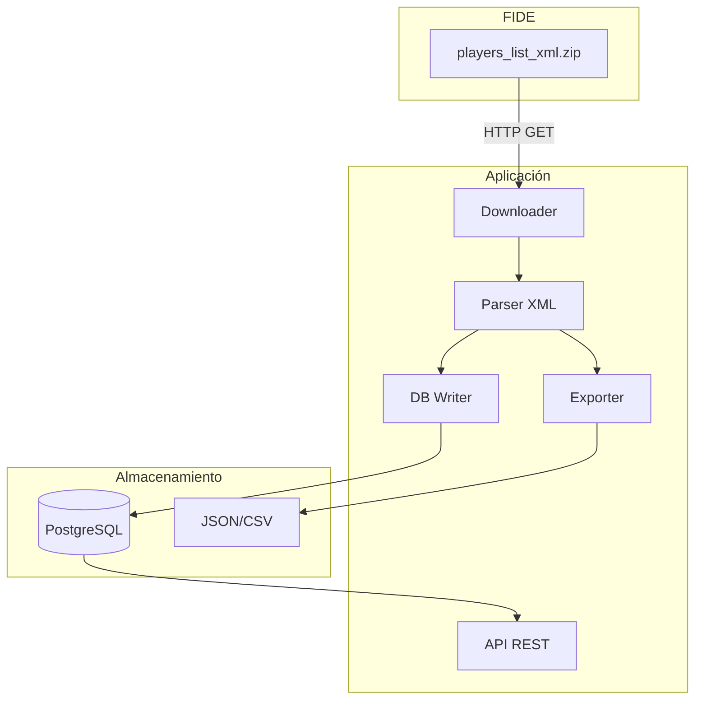

# Arquitectura

## Visión general

FIDE Scraper descarga los datos oficiales de la [Federación Internacional de Ajedrez (FIDE)](https://www.fide.com/), los procesa y los expone mediante una API REST. Utiliza **solo descargas oficiales** (no scraping HTML) para máxima robustez.

## Diagrama de flujo


```mermaid
flowchart TB
    subgraph external [FIDE]
        XML[players_list_xml.zip]
    end
    
    subgraph app [Aplicación]
        Downloader[Downloader]
        Parser[Parser XML]
        DBWriter[DB Writer]
        Exporter[Exporter]
        API[API REST]
    end
    
    subgraph storage [Almacenamiento]
        PG[(PostgreSQL)]
        Files[JSON/CSV]
    end
    
    XML -->|HTTP GET| Downloader
    Downloader --> Parser
    Parser --> DBWriter
    Parser --> Exporter
    DBWriter --> PG
    Exporter --> Files
    PG --> API
```

## Componentes

### 1. Downloader (`src/downloader.py`)

- Descarga el ZIP desde [FIDE Download](https://ratings.fide.com/download_lists.phtml); por defecto lista **combinada** `players_list_xml.zip` (STD+RPD+BLZ, ~48 MB), la misma familia que el enlace “Combined list … XML” en la web FIDE. El ZIP `*_foa.zip` es otro artefacto (menor tamaño) y puede no coincidir con los ratings públicos del buscador.
- Soporta listas históricas con `?period=YYYY-MM-DD`.
- **Streaming a disco**: `httpx` escribe el ZIP en un temporal; el primer `.xml` del ZIP se extrae a otro temporal con `shutil.copyfileobj` (sin cargar el XML completo en RAM). El context manager `extracted_xml_tempfile` borra ambos al terminar.
- `download_fide_xml()` sigue existiendo como legado (lee el XML entero a bytes) y no se usa en el importador principal.

### 2. Parser (`src/parser.py`)

- `ET.iterparse` en evento `end` solo para elementos `<player>`; tras procesar cada jugador se hace `elem.clear()` para liberar memoria (no se hace `clear` en hijos antes del `end` de `player`, para no romper el árbol).
- `parse_players_xml_path` / `parse_players_xml_stream` leen desde ruta o stream binario; el importador parsea desde archivo en disco.
- Maneja namespaces por nombre local del tag.
- Campos extraídos: `fideid`, `name`, `country`, `sex`, `title`, `rating`, `games`, `rapid_rating`, `blitz_rating`, `birthday`, `foa_title`, etc.

### 3. Base de datos
- **PostgreSQL 16** con modelo `Player`
- Índices en `fideid`, `country`, `rating` y compuesto `(country, rating)`
- Upsert por `fideid` para actualizaciones idempotentes

### 4. Importer (`src/importer.py`)

- Orquesta el pipeline: descarga → parse → upsert DB → export
- Procesa en batches de 5000 registros
- Exporta hasta 100.000 jugadores a JSON/CSV (configurable)

### 5. Exporter (`src/exporter.py`)

- Export a JSON
- Export a CSV
- Export opcional por país (`export_by_country`)

### 6. API REST (`src/api/`)

- FastAPI con documentación automática en `/docs`
- Endpoints: `/health`, `/players`, `/players/{fideid}`, progress, stats, etc.
- Filtros: paginación, país, rating mínimo
- Si `FIDE_SCRAPER_API_KEY` está definida, las rutas bajo `/players` exigen header `X-API-Key`; `GET /health` permanece público

## Estructura del proyecto

```
fide-Scraper/
├── src/
│   ├── config.py       # Configuración
│   ├── downloader.py   # Descarga XML FIDE
│   ├── parser.py       # Parseo XML
│   ├── models.py       # Modelo Player
│   ├── database.py     # Conexión DB
│   ├── importer.py     # Pipeline completo
│   ├── exporter.py     # Export JSON/CSV
│   └── api/
│       ├── main.py     # FastAPI app
│       ├── deps.py     # API key opcional
│       └── routes.py   # Rutas
├── scripts/
│   └── run_import.py   # CLI importación
├── docs/               # Documentación
├── Dockerfile
├── docker-compose.yml
└── requirements.txt
```

## Modelo de datos

| Campo | Tipo | Descripción |
|-------|------|-------------|
| `fideid` | int | ID único FIDE |
| `name` | str | Nombre completo |
| `country` | str | Código federación (ej: ESP, USA) |
| `sex` | str | M/F |
| `title` | str | Título (GM, IM, FM, etc.) |
| `rating` | int | Rating estándar |
| `games` | int | Partidas estándar |
| `rapid_rating` | int | Rating rápido |
| `rapid_games` | int | Partidas rápidas |
| `blitz_rating` | int | Rating blitz |
| `blitz_games` | int | Partidas blitz |
| `birthday` | int | Año de nacimiento |
| `flag` | str | Inactividad (I, WI, w) |

## Frecuencia de actualización FIDE y estrategia de almacenamiento

FIDE publica el listado combinado el último día de cada mes, pero los ZIP *actuales* de
standard/rapid/blitz (`get_current_xml_zip_urls`) reflejan cambios con más frecuencia que eso.
Para aprovecharlo sin que `fide.player_rating_history` crezca sin control, conviven dos
mecanismos de escritura sobre la misma tabla:

| Mecanismo | Cadencia | Qué escribe | Para qué sirve |
|---|---|---|---|
| Backfill mensual (`run_import_history`, `_month_periods`/`current_year`) | 1 vez al mes | Snapshot **denso**: una fila por jugador por mes calendario | Selector de "ver el ranking de tal mes" (histórico) |
| Sincronización diaria (`run_daily_change_sync`) | Diaria (o la que se configure) | **Solo** las filas cuyo rating cambió desde la última corrida — incluida la baja explícita a NULL de una modalidad que deja de figurar | "Subidas del mes", "Nuevos rankeados", posición vigente, Trayectoria |

La sincronización diaria trata la tabla como un **log de cambios** (slowly-changing-dimension),
no como una foto completa por corrida: compara, jugador por jugador, el valor entrante contra el
último conocido (`DISTINCT ON (fideid) ... ORDER BY period DESC`) y solo persiste donde hay una
diferencia real. Esto la hace correr todos los días sin generar una fila por jugador por día — el
volumen queda acotado a cambios de Elo reales, no a la cadencia de ejecución — y sin romper el
snapshot mensual, que sigue siendo la fuente para navegar meses históricos.

Las lecturas de "vigente" en `PublicResource` (gainers, nuevos rankeados) resuelven el valor de
cada jugador con el mismo patrón **as-of** (último valor conocido hasta una fecha de corte), en
vez de comparar contra el vecino inmediato en la tabla — así el resultado es correcto sea cual
sea la mezcla de filas densas (mensuales) y dispersas (diarias) que haya entre medio.

- **Recomendación**: `fide-import` + `fide-import-history` el día 1 de cada mes; `fide-daily-sync`
  todos los días (ver [DEPLOYMENT.md](DEPLOYMENT.md#actualización-snapshot-mensual--sincronización-diaria)).
